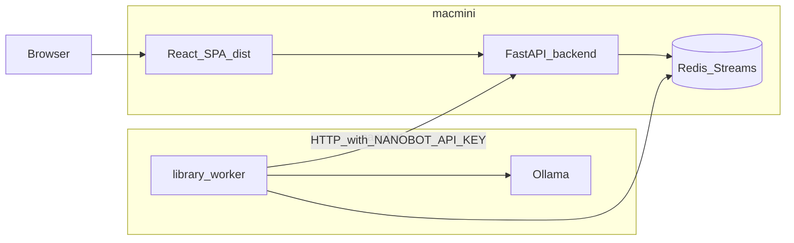

# System Patterns

## RAG chat (AMA and Workspace)

- **Orchestration:** `backend/chat/chat_service.py` — retrieval, context assembly, streaming.
- **Relevance gating:** `backend/chat/safeguard.py` — refuses or tightens answers when chunk scores are weak (mitigates hallucination).
- **LLM transport:** `backend/chat/ollama_client.py` — async HTTP to Ollama; thinking blocks / streaming controlled by `CHAT_ENABLE_THINKING` and related settings.
- **Suggestions:** `backend/chat/suggestions.py` — optional prompt suggestions.

AMA and Workspace differ by **which index** and **auth**; routes live under `/api/chat` (see `backend/routes/chat.py`).

## Library Research (distributed)

1. **Submit / list / detail / SSE:** `backend/routes/library.py` → `backend/library/service.py`.
2. **Queue:** `backend/library/queue.py` — abstract backend; production uses **Redis Streams** (`library:jobs`, `library:status:{job_id}`, cancel keys, group **`workers`**). Lazy-imports redis so import does not hard-fail without the package.
3. **Worker mirror:** `worker/queue_consumer.py` + `worker/main.py` — same stream names; runs pipeline in `worker/synthesizer/`.
4. **Learn / quality gate for imported knowledge:** `backend/learn/learn_engine.py` (invoked from library service paths — **not** `mcp_server/tools/learn_engine.py`).

## Document indexing

- **API surface:** `backend/routes/index.py`, `backend/routes/documents.py` (and related services).
- **Processing pipeline:** Under **`backend/indexers/`** — processors (PDF, text, CSV, etc.), `utils/` for NLP classifier, cross-reference, chunking, QA.
- **Conceptual mirror:** Top-level **`indexers/`** documents layout in `indexers/README.md` (categories, JSONL line shape).

## Deduplication and NLP

- Workspace/dedup intensity from env (`DEDUPLICATION_INTENSITY`, `ENABLE_CROSS_FILE_DEDUP`) wired through indexing config.
- **spaCy**-based classification and tagging in indexer utilities; phrase matchers and tag limits configured via `backend/config.py` and admin where applicable.

## Static SPA + health diagnostics

- If `frontend/dist/` exists, `backend/main.py` mounts `/assets` and serves SPA **index.html** with **no-store** headers for HTML.
- **`GET /api/health`** returns `git_head_short` and optional `frontend.index_html_built_at` — use to verify Mac mini / Linux deploy sees the same built bundle as disk.

## Auth and sessions

- **SQLite** via `backend/database.py`; middleware in `backend/auth/`.
- **Periodic cleanup:** `backend/main.py` `_session_cleanup` — expired sessions and long-inactivity users lose data unless **preserve** flag is set in storage.
